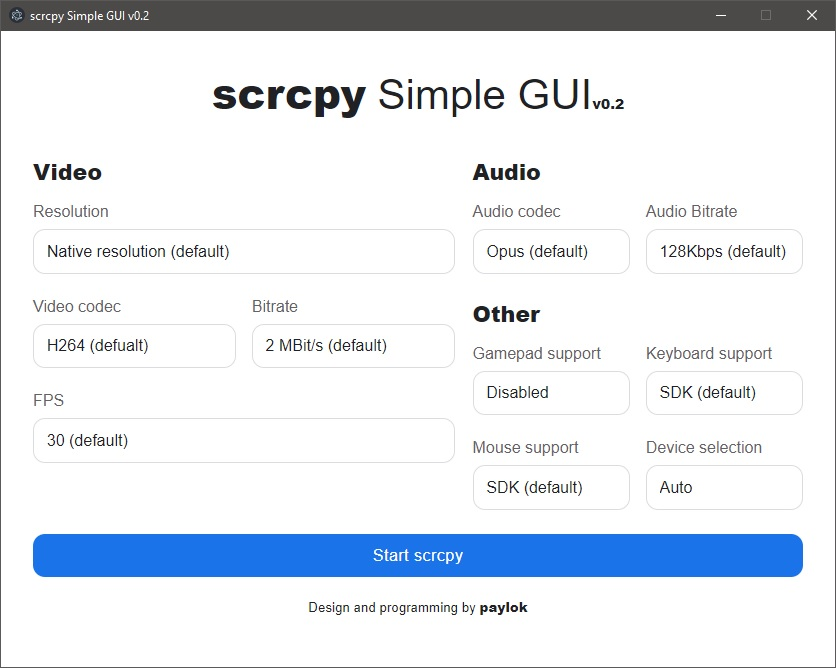

# scrcpy Simple GUI v0.2

This is a simple graphical user interface (GUI) for scrcpy. It allows easy configuration of video, audio, and other settings before starting the scrcpy session.



## Run from source

Init NodeJS
    ```bash
    npm install
    ```
Run script
    ```bash
    npm start
    ```
or just use start.bat on Windows

## Authors

- [@paylok ](https://github.com/ThePajlok)
